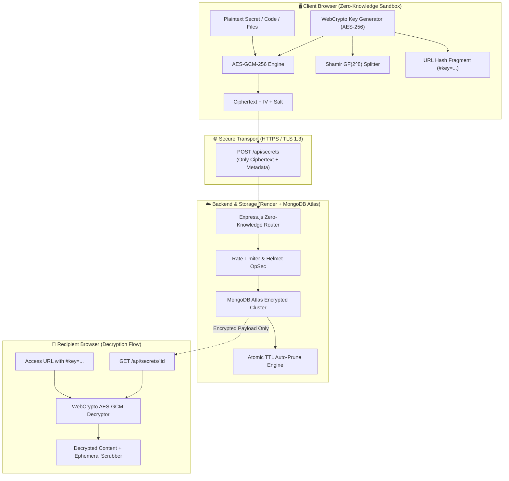

# 🧩 JigsawBin — Zero-Knowledge Ephemeral Information Exchange

[](https://react.dev/)
[](https://www.typescriptlang.org/)
[](https://nodejs.org/)
[](https://www.mongodb.com/)
[](#cryptographic-architecture)
[](LICENSE)

> **JigsawBin** is an advanced, privacy-first, zero-knowledge ephemeral pastebin, code IDE, and multi-vault encrypted file sharing platform. Built with client-side hardware WebCrypto (AES-256-GCM), Shamir's Secret Sharing ($K$-of-$N$ Quorum), post-open vanishing timers, physical OpSec privacy shields, and verifiable remote secret revocation.

---

## 🌐 Live Production Deployments

* **Frontend (Vercel):** [https://jigsawbin.vercel.app](https://jigsawbin.vercel.app)
* **Backend API (Render):** [https://jigsawbin.onrender.com](https://jigsawbin.onrender.com)
* **API Health Check:** [https://jigsawbin.onrender.com/health](https://jigsawbin.onrender.com/health)

---

## 🌟 Key Features & Innovations

### 1. 🔒 True Zero-Knowledge End-to-End Encryption
* All encryption and decryption occurs **strictly inside the client browser** using the W3C **Web Crypto API** (Hardware-accelerated AES-256-GCM).
* Decryption keys are stored **exclusively in the URL hash fragment** (`#key=...`). RFC 3986 specifies that URL fragments are **never transmitted to the server**, ensuring that neither the host, database, nor network interceptors ever see the plaintext or decryption keys.
* Optional secondary passphrases derive encryption keys via **PBKDF2-HMAC-SHA256 with 600,000 iterations** and unique 128-bit cryptographic salts.

### 2. 👥 Multi-Party Shamir Key Splitting ($K$-of-$N$ Quorum)
* Allows a master secret key to be split into $N$ distinct threshold shares using polynomial arithmetic over Galois Field $GF(2^8)$.
* Requires a minimum quorum of $K$ trustees ($K \le N$) to reconstruct the master key and decrypt the payload.
* Ideal for multi-signature access, executive approvals, emergency escrow, and decentralized secret distribution.

### 3. 💻 Interactive Zero-Knowledge Code IDE
* Multi-language developer IDE with integrated syntax highlighting (JavaScript, TypeScript, Python, C++, Rust, Go, SQL, HTML, CSS, Bash, YAML, JSON).
* Automatic code language detection, synced line-number gutters, live tab indentation, and clipboard tools.

### 4. 🗄️ Multi-File Encrypted Vault
* Client-side stream chunking and encryption for documents, archives, images, and binaries.
* Automatic SHA-256 integrity checksum verification before decryption and download.

### 5. ⏱️ Ephemeral Scrubbing & Atomic Burn-on-Read
* **Atomic Read Quotas:** Set secrets to self-destruct after 1, 3, 5, or 10 views. Once reached, ciphertext is permanently expunged.
* **Vanishing Countdown Timers:** Post-open countdowns (30s, 60s, 2m, 5m) that scrub and zeroize decrypted content from browser memory upon expiry.
* **MongoDB Native TTL Workers:** Automated hardware TTL eviction indexes that wipe expired records with zero administrative overhead.

### 6. 🛡️ Physical OpSec & Anti-Shoulder Surfing
* **Privacy Lens:** Dynamic Gaussian blur filter that only reveals text directly underneath the cursor hover area.
* **Panic Decoy Mask (`ESC` key):** Instant emergency hotkey that swaps the confidential screen for a realistic generic documentation decoy.
* **Duress Canary PIN:** Enter a decoy PIN during decryption that triggers silent, instant database eradication of the secret record while presenting a generic error message.

### 7. 📊 Audit Telemetry & Remote Revocation
* Senders receive an **irrevocable cryptographic management token** to monitor view counts, expiration states, and permanently delete secrets on-demand before recipients view them.

---

## 🏗️ System Architecture



---

## 📂 Project Structure

```
jigsaw/
├── backend/                  # Node.js Express REST API
│   ├── src/
│   │   ├── config/           # MongoDB Atlas resilient connection with retry
│   │   ├── controllers/      # Zero-knowledge secret & telemetry controllers
│   │   ├── models/           # Mongoose schemas with native TTL indexing
│   │   ├── routes/           # REST endpoints with route-specific rate limits
│   │   └── server.js         # Production server with Helmet & CORS
│   └── package.json
│
├── frontend/                 # React 19 + TypeScript + Vite + Tailwind CSS
│   ├── src/
│   │   ├── api/              # Resilient Axios API client with cold-start timeout
│   │   ├── components/       # Code IDE Editor, Privacy Lens, Countdown Timers
│   │   ├── pages/            # CreateSecret, ViewSecret, ManagementPortal, Stats
│   │   ├── utils/            # WebCrypto AES-GCM, Shamir GF(2^8), Identicons
│   │   ├── App.tsx           # Router and Navigation Shell
│   │   └── main.tsx          # React Root Entrypoint
│   └── vite.config.ts
│
├── docs/                     # Comprehensive Architecture & API Documentation
│   ├── ARCHITECTURE.md       # Deep Cryptographic Specification & Threat Model
│   └── API_DOCUMENTATION.md  # Complete OpenAPI-style REST API Specification
│
├── Dockerfile                # Multi-stage container build for Render
├── vercel.json               # SPA routing configuration for Vercel
└── README.md
```

---

## ⚙️ Tech Stack & Cryptography Matrix

| Component | Technology | Purpose |
|---|---|---|
| **Frontend Framework** | React 19, TypeScript, Vite | Ultra-fast client-side reactive rendering |
| **Styling & Icons** | Tailwind CSS, Lucide React | Cyberpunk dark UI & high-contrast themes |
| **Symmetric Encryption** | AES-256-GCM (Web Crypto API) | Authenticated 256-bit encryption with 96-bit IV |
| **Key Derivation** | PBKDF2-HMAC-SHA256 | 600,000 iterations for passphrase protection |
| **Secret Sharing** | Shamir's Scheme over $GF(2^8)$ | $K$-of-$N$ threshold quorum key reconstruction |
| **Backend Server** | Node.js, Express.js | High-throughput zero-knowledge metadata router |
| **Database** | MongoDB Atlas | Distributed document store with TTL workers |
| **Code Highlighting** | PrismJS | Syntax highlighting across 15+ languages |
| **Hosting & Cloud** | Vercel (Client) + Render (API) | Global edge deployment with high availability |

---

## 🚀 Quick Start (Local Development)

### Prerequisites
* **Node.js**: v18.0.0 or later
* **npm**: v9.0.0 or later
* **MongoDB**: Local instance or MongoDB Atlas URI

### 1. Clone Repository
```bash
git clone https://github.com/ishaen06/clonefest26.git
cd clonefest26
```

### 2. Backend Setup
```bash
cd backend
npm install

# Create .env file
echo "PORT=5000" > .env
echo "MONGO_URI=mongodb+srv://<user>:<password>@cluster0.mongodb.net/jigsawbin?retryWrites=true&w=majority" >> .env
echo "NODE_ENV=development" >> .env

npm run dev
```
Backend runs at `http://localhost:5000`.

### 3. Frontend Setup
```bash
cd ../frontend
npm install

# Create .env file
echo "VITE_API_URL=http://localhost:5000/api" > .env

npm run dev
```
Frontend runs at `http://localhost:5173`.

---

## 📖 Detailed Documentation

* 📚 [**System Architecture & Cryptographic Deep Dive**](./docs/ARCHITECTURE.md)
* 📡 [**Complete REST API Reference & Request/Response Schemas**](./docs/API_DOCUMENTATION.md)

---

## 🛡️ Security & Privacy Assurance

1. **No Plaintext Logging:** The server logs only masked metadata and access timestamps.
2. **Zero-Key Storage:** The server database only stores ciphertext and initialization vectors (`iv`). Decryption keys never touch backend memory or logs.
3. **Hardware Web Crypto:** Cryptographic operations leverage browser hardware acceleration, preventing side-channel attacks common in pure JavaScript crypto libraries.
4. **Memory Hygiene:** Decrypted secrets in the recipient view are scrubbed on unmount, page reload, or timer expiration.

---

## 📜 License
MIT License. Created with ❤️ for advanced zero-knowledge privacy.
