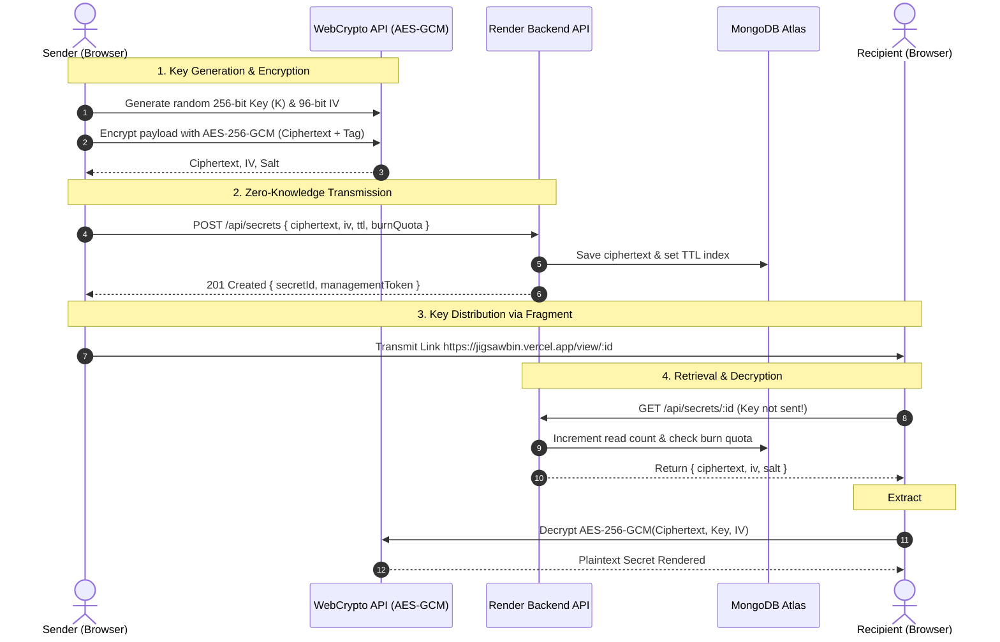

# 🏛️ JigsawBin Architecture & Cryptographic Specification

## 1. Executive Summary

JigsawBin is designed around the **Zero-Knowledge Principle**: the server acts purely as an untrusted ciphertext relay and expiration manager. At no point in the lifecycle does the server possess the plaintext, the encryption key, or the passphrase used to secure the data.

---

## 2. Cryptographic Lifecycle

---

## 3. Cryptographic Standards

### 3.1 Symmetric Cipher: AES-256-GCM
* **Algorithm:** Advanced Encryption Standard in Galois/Counter Mode (AES-GCM).
* **Key Length:** 256 bits (32 bytes), generated via `crypto.getRandomValues()`.
* **Initialization Vector (IV):** 96 bits (12 bytes), generated uniquely for every encryption operation.
* **Authentication Tag:** 128 bits (16 bytes), embedded directly in the WebCrypto ciphertext output to verify integrity and detect tampering.

### 3.2 Key Derivation Function: PBKDF2
When an optional passphrase is provided by the user:
* **Algorithm:** PBKDF2 (Password-Based Key Derivation Function 2).
* **Hash Function:** HMAC-SHA-256.
* **Iterations:** 600,000 rounds (exceeding OWASP recommended standards).
* **Salt:** 128-bit (16 bytes) cryptographically secure pseudorandom salt.

### 3.3 Shamir's Secret Sharing ($K$-of-$N$ Quorum)
To enable multi-party trust without a centralized key custodian, JigsawBin implements Shamir's Secret Sharing over Galois Field $GF(2^8)$ with irreducible polynomial:
$$P(x) = x^8 + x^4 + x^3 + x + 1 \quad (0\text{x}11\text{B})$$

#### Mathematical Formulation:
1. **Share Splitting:** A polynomial $f(x)$ of degree $k-1$ is constructed:
   $$f(x) = S + a_1 x + a_2 x^2 + \dots + a_{k-1} x^{k-1} \pmod{P(x)}$$
   where $S$ is the secret byte and $a_1, \dots, a_{k-1}$ are randomly chosen coefficients in $GF(2^8)$.
2. **Share Generation:** $n$ shares $(x_1, f(x_1)), (x_2, f(x_2)), \dots, (x_n, f(x_n))$ are generated with distinct $x_i \neq 0$.
3. **Quorum Reconstruction:** With any $k$ shares, Lagrange interpolation recovers the master secret:
   $$S = \sum_{j=1}^k y_j \prod_{\substack{m=1 \\ m \neq j}}^k \frac{x_m}{x_m \oplus x_j}$$

---

## 4. Threat Model & Mitigation Analysis

| Threat Vector | Potential Impact | JigsawBin Mitigation |
|---|---|---|
| **Compromised Backend Server** | Attacker dumps entire database | Ciphertext is encrypted with AES-256-GCM. Decryption keys are stored only in URL fragments and never touch the server. |
| **Man-in-the-Middle (MitM)** | Intercepting network traffic | TLS 1.3 enforced. URL fragments (`#key=...`) are strictly client-side and never sent in HTTP request headers. |
| **Database Exposure (Data at Rest)** | Leak of persistent records | Zero plaintext storage. Native MongoDB TTL indexes expunge expired records automatically. |
| **Physical Shoulder Surfing** | Observer looking at recipient screen | Interactive Privacy Lens applies dynamic Gaussian blur over sensitive areas until hovered. Panic Key (`ESC`) swaps screen for decoy interface. |
| **Physical Coercion / Extortion** | Attacker forcing recipient to decrypt | Duress Canary PIN silently purges the secret from the database immediately while returning a standard decryption error. |
| **Memory Extraction / RAM Dumps** | Forensic dump of browser memory | Ephemeral countdown timer zeroizes and scrubs decrypted strings from memory after the countdown window expires. |

---

## 5. Ephemeral Storage & Retention Flow

1. **Active State:** Secret exists in database with `readCount < burnAfterReads` and `expiresAt > now()`.
2. **Read Counter Increment:** When a recipient views the secret, the server atomically increments `readCount` in a single transaction.
3. **Atomic Destruction:** If `readCount >= burnAfterReads`, `isBurned` is flagged `true` and ciphertext is permanently wiped.
4. **TTL Expiration:** MongoDB native background workers continually scan the `expiresAt` index and purge documents with `expiresAt < now()`.
